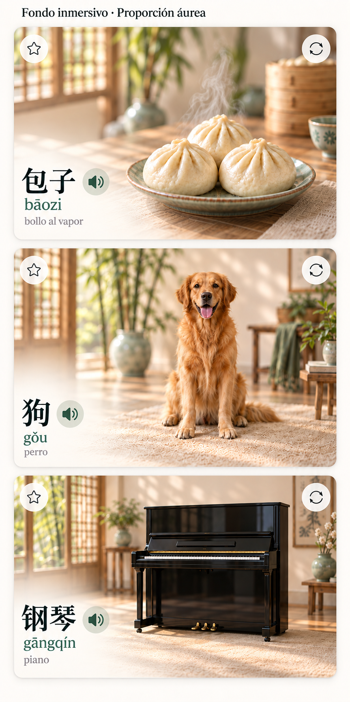

# Vocabulario Míng · Fondo inmersivo chino

Estándar visual por defecto aprobado por el usuario el 25 de septiembre de 2026.
Identificador: `ming-vocabulary-immersive-zh-golden-v1`. Versión: `1.1.0`.

## Consulta rápida

- Parámetros exactos: [`vocabulary-style.json`](vocabulary-style.json).
- Prompt de implementación y generación de fotografías: [`VOCABULARY_IMPLEMENTATION_PROMPT.md`](VOCABULARY_IMPLEMENTATION_PROMPT.md).
- Referencia visual elegida: [`references/vocabulary-immersive-zh-approved.png`](references/vocabulary-immersive-zh-approved.png).

La referencia es **la segunda propuesta de la última tanda**, con tres tarjetas
horizontales apiladas de baozi, perro y piano. Deriva de la opción 2, «Fondo
inmersivo», con fondo chino difuminado y traducción reducida. No es la opción 4
«Estudio continuo» ni la primera versión demasiado panorámica.

La imagen generada orienta fotografía, ambiente y jerarquía. Sus dimensiones,
glifos, texto y espaciado son aproximados. **Los parámetros de este estándar
prevalecen sobre los píxeles de la maqueta**. El contenido lingüístico proviene
del corpus auditado. No extraer traducciones ni pinyin de esta imagen.

## Alcance y estado

Este registro guarda una decisión de producto, no evidencia curricular. Reside
en `MING_KNOWLEDGE/design/`, separado del corpus v2 y de sus tablas de fuentes.
No requiere Supabase, migraciones, claves ni acceso a PDF para consultarlo.

Estado: **estándar aprobado y documentado; aplicación a la web pendiente**.
Este es el estado al guardar el PR #12. La aplicación local posterior de layout,
tipografía e interacción y el límite de fotografías pendientes se documentan en
[`VOCABULARY_PR11_PR12_LOCAL.md`](../../docs/VOCABULARY_PR11_PR12_LOCAL.md).
Publicar estos archivos no implica que el diseño esté implementado o desplegado.
Se aplica por defecto a las fichas de vocabulario del catálogo, con o sin foto,
en todas las lecciones y vistas acumuladas. Vocabulario Mix debe compartir los
tokens de imagen, tipografía y audio cuando reutilice esa ficha; sus controles
de sesión y evaluación quedan fuera del rectángulo de la ficha.

## Geometría por defecto

La **tarjeta entera**, incluidos fotografía, textos y controles, es un rectángulo
áureo horizontal. No aplicar la proporción solo al contenedor de la fotografía.

| Parámetro | Valor |
| --- | --- |
| Ancho / alto | `1.61803398875 / 1` |
| Ancho de referencia y máximo normal | `400 px` (`25rem`, con raíz de 16 px) |
| Alto calculado a 400 px | `247.2136 px` |
| Alto calculado a 360 px | `222.4922 px` |
| Alto calculado a 320 px | `197.7709 px` |
| Ancho disponible por ficha en rejilla | Al menos 288 px cuando la pantalla lo permita |
| Radio exterior | `18 px` |
| Margen interior del texto | `16 px`, reducible a `12 px` en móvil |
| Separación entre fichas | `16 px`, reducible a `12 px` en móvil |
| Área táctil de cada control | Mínimo `44 × 44 px` |

Usar `box-sizing: border-box`, `width: 100%`, `max-width: 25rem` y
`aspect-ratio: 1.61803398875 / 1`; dejar que CSS calcule el alto. No fijar 247 px
para todos los anchos. No sumar una banda inferior ni una fila superior de
botones fuera de esa proporción. En pantallas de 320–430 px, una sola columna:
evitar dos fichas de aproximadamente 170 px de ancho con texto ilegible.

La proporción es el **tamaño por defecto**, no una razón para cortar contenido.
Con zoom, tamaño de texto aumentado, palabras/traducciones largas o ejemplos
extensos en el reverso, permitir crecimiento vertical accesible y documentar
esa excepción. No resolverlo con texto diminuto, elipsis, recortes ni scroll
interno de la ficha. Mantener igual altura entre anverso y reverso cuando ambos
contenidos caben; una excepción de contenido debe ser explícita.

## Fotografía y composición

- Fotografía realista y cálida, a sangre hasta los bordes redondeados.
- Sujeto nítido, completo, reconocible y proporcional; fondo realmente
  desenfocado con poca profundidad de campo y bokeh suave. Aplicarlo también
  al perro, gato y piano, no solo a alimentos.
- Ambientación china contemporánea y sobria: celosías de madera, bambú,
  cerámica celadón, pared clara y luz natural. Dos o tres detalles secundarios
  bastan. Evitar decorado festivo recargado, dragones y rojo dominante.
- Sujeto hacia el centro/derecha; reservar espacio tranquilo abajo a la
  izquierda para la palabra, pinyin y traducción. Dejar libres las esquinas
  superiores para favoritos y giro.
- Unificar temperatura de luz, contraste y paleta. Variar de forma natural
  el ambiente según el objeto; no pegar todos los sujetos en una foto idéntica.
- Degradado marfil suave bajo el texto, integrado en toda la superficie. Sin
  recuadro de fotografía, borde interior, separador horizontal, marco blanco
  ni transición visible entre imagen y área de texto.
- No usar `contain` para encajar una fotografía cuadrada en una tarjeta ancha.
  Generar composiciones adecuadas al formato y comprobarlas con `cover` y
  posición focal controlada, sin cortar orejas, patas, cola, teclas o pedales.
- No aplicar `filter: blur()` a la fotografía completa: desenfocaría el sujeto.
- Sin foto, usar superficie marfil con la misma geometría, sin imágenes
  inventadas ni marcadores de error visibles.

Los assets definitivos deben ser **solo fotografías**, sin Hanzi, pinyin,
traducciones, iconos, botones, marcas comerciales ni marcas de agua. Textos y
controles son HTML accesible. No recortar la maqueta para usarla como asset.

## Jerarquía de texto y controles

Valores de referencia a tamaño normal de lectura (raíz de 16 px):

| Elemento | Tamaño | Peso | Color |
| --- | --- | --- | --- |
| Hanzi del anverso | 43.2 px; 38.4 px en móvil | 500 | `#173b32` |
| Pinyin | 16 px | 400 | `#466451` |
| Traducción española | **11.52 px** (`0.72rem`) | 400 | **`#746f68`** |
| Hanzi estudiado en el reverso | 24 px | 400 | `#687169` |
| Frase china en el reverso | 28 px; 26 px en móvil | 400 | `#173b32` |
| Coincidencia estudiada en la frase | Heredado de la frase | 700 | `#b34424` |

La traducción ocupa el tercer nivel y conserva la reducción solicitada del
20 % inicial más un 10 % adicional; el token definitivo es 11.52 px. No volver a asignarle el tamaño del pinyin
ni negro intenso. Respetar zoom y preferencias del navegador. Usar las familias
tipográficas ya cargadas por Míng, con soporte correcto de tonos y caracteres.

El audio se muestra en un área transparente de 44 px e icono
verde jade `#315848` de 20 px, sin borde duro, junto al Hanzi. Favoritos arriba
a la izquierda y giro arriba a la derecha, con fondo transparente y sin sombra.
No deben tapar el sujeto. Estado activo de favorito reconocible, etiquetas
accesibles, foco visible y operación por teclado. Solo mostrar audio si existe
un recurso reproducible; conservar los estados reales de reproducción.

El gradiente debe asegurar contraste suficiente para todos los textos,
especialmente la traducción tenue. Verificar contraste sobre el **fondo
compuesto real**, no solo contra una muestra de marfil. Si falla, reforzar el
degradado local antes de oscurecer o aumentar la traducción indiscriminadamente.

## Reverso y comportamiento que deben conservarse

El reverso usa fondo salvia `#e6eee5` y prioriza la frase. Reduce y atenúa la
palabra estudiada y oculta su audio en esa cara. La frase china es mayor y
resalta en negrita rojo/naranja la palabra o tramo pedagógico correspondiente.
Mantiene pinyin legible, traducción pequeña y «Otro ejemplo» visualmente
discreto con área táctil suficiente. El audio disponible de la frase va junto
a ella. Los caracteres enlazan a sus fichas Hanzi sin botón redundante.

Al cambiar lección, filtros, favoritos, página, activar/escribir en el buscador
o elegir una sugerencia, volver al anverso. Al recargar, empezar en el anverso.
No guardar las caras giradas como preferencia persistente. Favoritos y progreso
sí mantienen su persistencia. Conservar búsqueda global, partición exclusiva,
vínculos pedagógicos y ejemplos válidos del corpus. No reintroducir los textos
«procedencia», «escritura» ni controles retirados que consumen altura.

## Validación antes de aplicar una versión

1. Medir el rectángulo exterior en el navegador: `ancho / alto` cercano a phi
   (tolerancia 0.01 por redondeo) en fichas normales, con y sin imagen.
2. Comprobar baozi, perro, gato, piano, palabras largas, traducciones de varias
   líneas, imágenes ausentes y ejemplos largos. Ningún sujeto queda cortado.
3. Revisar anverso/reverso y anchos 320, 375, 390, 430, 768 y 1280 px en Chromium
   y WebKit. Sin solapes, desbordamiento horizontal ni salto innecesario al girar.
4. Probar teclado, etiquetas, contraste, controles táctiles, texto al 200 % y
   reducción de movimiento. Aceptar crecimiento por accesibilidad.
5. Comprobar audio real, favoritos, búsqueda, navegación Hanzi, reinicio de cara
   y persistencia de progreso. No generar audio para completar el diseño.
6. Registrar cualquier excepción o ajuste de tokens en el JSON y este documento;
   no crear valores divergentes por lección o por animal. Actualizar versión y
   conservar la trazabilidad de la referencia aprobada.

## Procedencia del diseño

Decisión del usuario: estilo de la segunda imagen de la última comparación,
proporción áurea para toda la ficha, fondo desenfocado con ambiente chino y
traducción pequeña y tenue. Imagen de referencia producida con la herramienta
integrada de generación de imágenes; no procede de los PDF del corpus.
El JSON registra el nombre original y SHA-256 para identificar exactamente el
archivo conservado. La especificación de CSS/medidas es normativa; la imagen
es únicamente referencia visual.

## Ajuste aprobado: 25 de septiembre de 2026

Hanzi principal +20 % (43.2 px; 38.4 px móvil), traducción −10 % adicional (11.52 px), pinyin sin cambios (16 px). Botones de la ficha transparentes, sin fondo ni sombra, con área táctil de 44 px y foco visible. Eliminar el panel blanco localizado detrás del texto; conservar únicamente la transición global suave de la fotografía a la izquierda. Estas indicaciones sustituyen los fondos de controles descritos en la versión inicial.
