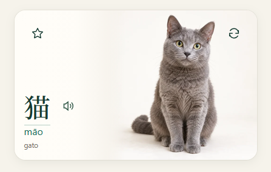

# Vocabulario Míng · Sujeto aislado transparente

Estándar visual por defecto aprobado por el usuario el 27 de septiembre de
2026. Identificador: `ming-vocabulary-transparent-subject-golden-v2`.
Versión: `2.0.0`.

## Consulta rápida

- Parámetros exactos: [`vocabulary-style.json`](vocabulary-style.json).
- Prompt de implementación y generación: [`VOCABULARY_IMPLEMENTATION_PROMPT.md`](VOCABULARY_IMPLEMENTATION_PROMPT.md).
- Referencia visual aprobada: [`references/vocabulary-transparent-subject-approved.png`](references/vocabulary-transparent-subject-approved.png).

La referencia muestra la composición deseada: tarjeta marfil horizontal,
contenido lingüístico abajo a la izquierda, controles en las esquinas y un
sujeto fotográfico aislado a la derecha. Es una **maqueta de interfaz**, no un
asset de producción ni una fuente curricular. Sus textos, glifos y medidas son
aproximados; este documento y el JSON prevalecen.

Este estándar sustituye a `ming-vocabulary-immersive-zh-golden-v1` versión
1.1.0. La referencia anterior se conserva únicamente para trazabilidad y deja
de ser el estilo por defecto.

## Principio visual

La tarjeta compone por separado:

1. una superficie de color controlada por HTML/CSS;
2. una imagen del sujeto con **canal alfa real y fondo transparente**;
3. textos, gradientes y controles accesibles en HTML/CSS.

La imagen nunca debe traer fondo blanco, marfil, decorado, rectángulo, texto,
iconos ni color de tarjeta horneados. La tarjeta decide el color de fondo y
puede cambiarlo sin regenerar el asset. El sujeto debe conservar una apariencia
fotográfica natural, limpia y reconocible; no se usa ya el ambiente chino
desenfocado, el bokeh ni la fotografía a sangre del estándar anterior.

## Alcance y estado

Es una decisión de producto separada del corpus curricular. Se aplica por
defecto a fichas de Vocabulario con o sin imagen, en lecciones y vistas
acumuladas. Vocabulario Mix comparte los tokens visuales cuando reutiliza la
misma ficha. Guardar este estándar no demuestra que el runtime esté actualizado
ni autoriza generar assets, modificar Supabase o desplegar producción.

## Geometría de la tarjeta

La **tarjeta completa**, incluidos sujeto, textos y controles, mantiene el
rectángulo áureo horizontal.

| Parámetro | Valor |
| --- | --- |
| Ancho / alto | `1.61803398875 / 1` |
| Ancho de referencia y máximo normal | `400 px` (`25rem`) |
| Alto calculado a 400 px | `247.2136 px` |
| Alto calculado a 360 px | `222.4922 px` |
| Alto calculado a 320 px | `197.7709 px` |
| Ancho útil mínimo por ficha | `288 px` cuando la pantalla lo permita |
| Radio exterior | `18 px` |
| Margen interior | `16 px`, reducible a `12 px` en móvil |
| Separación | `16 px`, reducible a `12 px` en móvil |
| Área táctil | mínimo `44 × 44 px` |

CSS base: `box-sizing:border-box; width:100%; max-width:25rem;
aspect-ratio:1.61803398875 / 1`. No fijar 247 px para todos los anchos. En
320–430 px usar una columna. Con zoom, texto grande o contenido largo se permite
crecimiento vertical; nunca recortar texto, usar elipsis o reducirlo para forzar
la proporción.

## Superficie y capa de imagen

- Superficie por defecto: marfil cálido `#fffdf8`, dibujado por la tarjeta.
- Borde: `1 px solid #e5e0d6`; sombra discreta
  `0 4px 16px rgba(38, 56, 43, 0.08)`.
- La capa de imagen es independiente y no define el fondo de la ficha.
- El sujeto se coloca a la derecha, normalmente en `x=46–96%` y `y=3–96%`.
- Reservar `x=4–43%`, especialmente `y=55–94%`, para Hanzi, pinyin,
  traducción y audio. Mantener ambas esquinas superiores tranquilas.
- El sujeto debe estar completo: orejas, patas y cola; plato y alimento;
  teclado, tapa, patas y pedales; asas y extremos de objetos.
- Usar `object-fit:contain` para la capa transparente y una posición focal a la
  derecha. No ampliar hasta cortar partes para llenar el rectángulo.
- Se admite una sombra de contacto muy suave y semitransparente integrada en el
  alfa para evitar que el sujeto parezca flotar. No se admite suelo opaco.
- Sin imagen, mostrar solo la superficie de la tarjeta; no inventar sustitutos
  ni enseñar indicadores de error al alumno.

### Requisitos del asset

- PNG maestro con alfa; WebP con alfa es válido como derivado web.
- Lienzo maestro objetivo `1618 × 1000 px`. Si el modelo solo ofrece un tamaño
  próximo, componer y luego normalizar sobre un lienzo transparente con esa
  proporción sin deformar ni cortar el sujeto.
- Sujeto fotográfico, nítido, de color natural y recorte limpio.
- Bordes sin halo blanco, negro o de color; pelo y detalles finos conservados.
- Píxeles de las esquinas con alfa 0; comprobar que el archivo no sea una imagen
  RGB blanca disfrazada de transparencia.
- Sin texto, Hanzi, pinyin, traducciones, iconos, botones, marcas, logos,
  marcas de agua, marcos, fondos ni elementos secundarios dominantes.

## Jerarquía de texto y controles

| Elemento | Tamaño | Peso | Color |
| --- | --- | --- | --- |
| Hanzi del anverso | 43.2 px; 38.4 px móvil | 500 | `#173b32` |
| Pinyin | 16 px | 400 | `#466451` |
| Traducción española | 11.52 px (`0.72rem`) | 400 | `#746f68` |
| Hanzi estudiado en reverso | 24 px | 400 | `#687169` |
| Frase china en reverso | 28 px; 26 px móvil | 400 | `#173b32` |
| Coincidencia estudiada | heredado | 700 | `#b34424` |

El bloque frontal se alinea abajo a la izquierda. Puede añadirse detrás un
degradado marfil CSS muy sutil si hace falta contraste, pero nunca debe formar
parte del PNG. El audio usa área transparente de 44 px e icono jade `#315848`
de 20 px junto al Hanzi. Favorito arriba a la izquierda y giro arriba a la
derecha, ambos transparentes y sin sombra. No deben solaparse con el sujeto.
Conservar foco visible, etiquetas accesibles, teclado y estados reales.

## Reverso y comportamiento

El reverso conserva fondo salvia `#e6eee5`, frase prioritaria, palabra estudiada
atenuada, énfasis pedagógico `#b34424`, pinyin, traducción y audio de frase si
existe. Oculta el audio de la palabra en esta cara. «Otro ejemplo» conserva
`#f5f8f2`, borde `#c4d1c0` y área táctil de 44 px. Los caracteres disponibles
enlazan a sus fichas Hanzi sin botón redundante. No reintroducir procedencia,
«escritura» ni explicaciones técnicas dentro de la tarjeta. La fotografía del
anverso no se hornea en el reverso.

Al cambiar lección, filtros, favoritos, página, búsqueda o selección global,
volver al anverso. Al recargar, empezar en el anverso. No persistir caras
giradas; favoritos y progreso sí. Conservar IDs curriculares, relaciones
pedagógicas, búsqueda global y audio existente. Los ejemplos se resuelven con
los vínculos auditados, nunca mediante coincidencias por substring.

## Validación

1. Medir la ficha normal: ancho/alto cercano a phi, tolerancia `0.01`.
2. Verificar alfa real y ausencia de fondo en baozi, perro, gato, piano y
   objetos claros u oscuros.
3. Comprobar que ningún sujeto queda cortado y que no invade textos ni controles.
4. Probar distintos colores de superficie para detectar halos o fondos horneados.
5. Revisar anverso/reverso en 320, 375, 390, 430, 768 y 1280 px, Chromium y
   WebKit; incluir teclado, contraste, texto al 200 % y movimiento reducido.
6. Registrar prompt, versión de estilo, ruta y estado de revisión de cada asset.

## Procedencia

Decisión del usuario del 27 de septiembre de 2026: reemplazar las fotografías
ambientadas por sujetos aislados de fondo transparente; la tarjeta proporciona
el color de fondo. La captura aprobada se conserva como referencia de composición
y no debe recortarse para producir assets.
